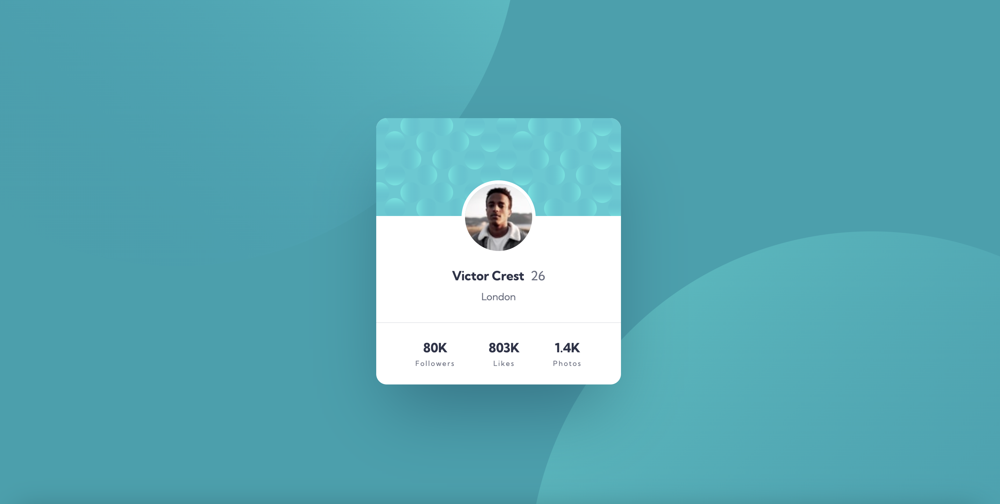

# Frontend Mentor - Profile card component solution

This is a solution to the [Profile card component challenge on Frontend Mentor](https://www.frontendmentor.io/challenges/profile-card-component-cfArpWshJ).

## Table of contents

- [Overview](#overview)
  - [The challenge](#the-challenge)
  - [Screenshot](#screenshot)
  - [Links](#links)
  - [Built with](#built-with)
  - [What I learned](#what-i-learned)
- [Author](#author)

## Overview

### The challenge

Your challenge is to build out this profile card component and get it looking as close to the design as possible.

### Screenshot



### Links

- Solution URL: 
- Live Site URL: https://vanessa-ayer.github.io/profile-card-component-main/

### Built with

- Semantic HTML5 markup
- CSS custom properties
- Flexbox

### What I learned 

Code snippet below

```css
 background-image: url(./images/bg-pattern-top.svg),
    url(./images/bg-pattern-bottom.svg);
  background-repeat: no-repeat, no-repeat;
  background-position: right 48vw bottom 47vh, left 53vw top 46vh;
```


## Author

- Website - [Vanessa Ayer] https://github.com/vanessa-ayer
- Frontend Mentor - [vanessa-ayer](https://www.frontendmentor.io/profile/vanessa-ayer)
